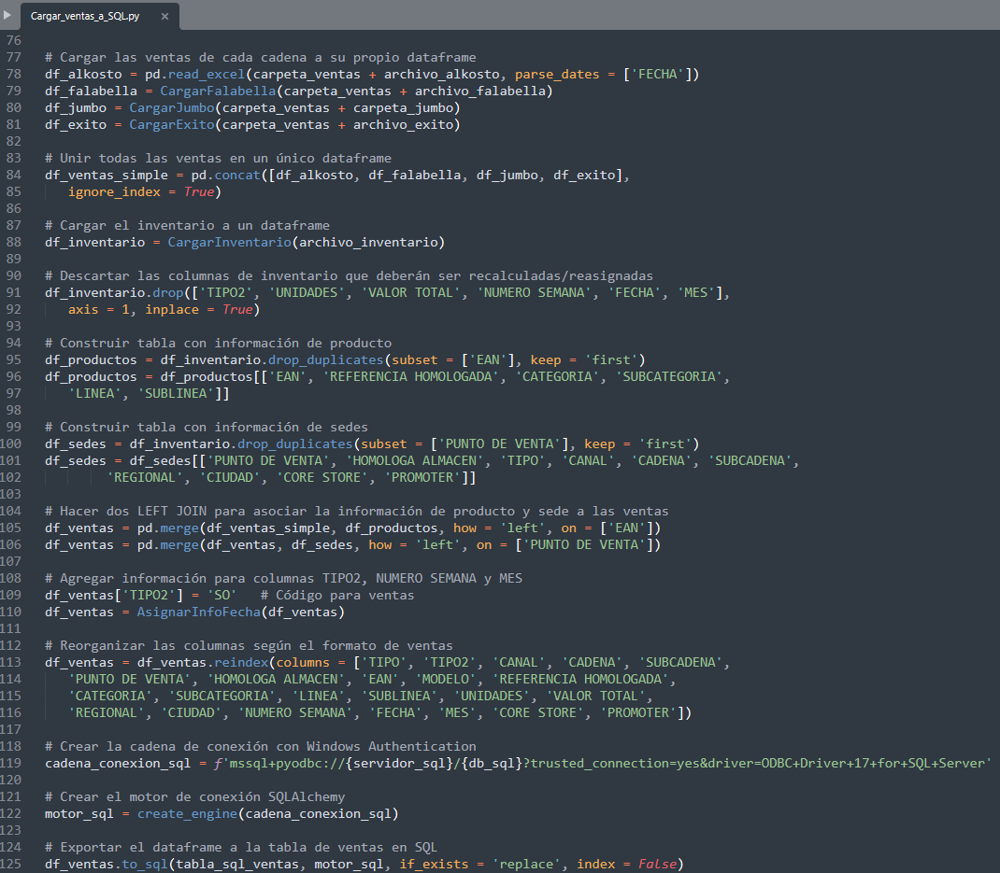

# Data_wrangling_Pandas

This python script uses Pandas to load and combine sales and inventory data from different Excel and Access files, which is then exported to an SQL database and used to conduct sales distribution analysis by chain, product line, and store.

The datasets in this project is confidential and for demonstration purposes only. Please refer to the [license](./LICENSE) for more details. The Access database file is not provided due to GitHub file size restrictions.

The following packages must be installed through pip, this can be done using the `pip install package_name` in the command prompt or terminal.

- pandas
- sqlalchemy
- openpyxl
- pyodbc

To run the [main script](./Cargar_ventas_a_SQL.py) you can use Python IDLE. Navigate to the folder where you have downloaded all files and open and run "Cargar_ventas_a_SQL.py", or use the following command in the IDLE Shell: `exec(open('Cargar_ventas_a_SQL.py').read())`.
